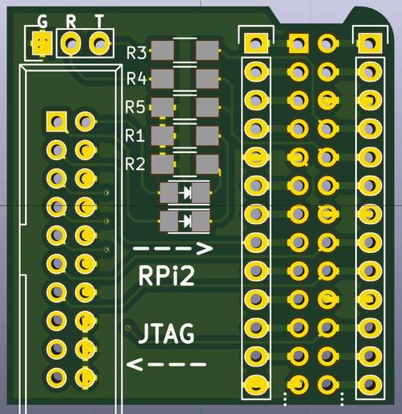

========
RPi-JTAG
========

Raspberry Pi IO header to JTAG IDC-20P connector, plus optional UART connectors and power indicators.

Note that you need to first enable RPi JTAG mode (I use my minipi_ bootloader to do this).

license
-------

CERN OHL v1.2, because lets face it, this is rocket science ;)

see LICENSE_ for details

download
--------

The repository contains the KiCad project. There are also standalone schematics_ and gerber files for
oshpark_ and dirtypcbs_ (and itead/seeed). Note that I have only tested dirtypcbs.

.. _minipi: https://bitbucket.org/vahidi/mini-pi-bootloader
.. _oshpark: https://bitbucket.org/vahidi/rpi-jtag/raw/master/data/oshpark.zip
.. _dirtypcbs: https://bitbucket.org/vahidi/rpi-jtag/raw/master/data/dirtypcbs.zip
.. _schematics: https://bitbucket.org/vahidi/rpi-jtag/raw/master/data/schema.pdf
.. _LICENSE: https://bitbucket.org/vahidi/rpi-jtag/raw/master/LICENSE

.. image:: data/bottom.jpg
	   :alt: botom view
