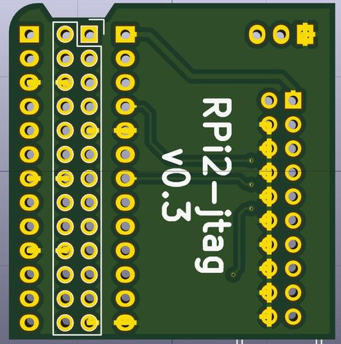

========
rpi-jtag
========

.. image:: data/side.jpg
	   :alt: side view

Raspberry Pi IO to 20P JTAG connector. Plus optional UART pins and power indicators...

Note that you need to first enable RPi JTAG mode
(I use my minipi_ bootloader to do this).

.. _minipi: https://bitbucket.org/vahidi/mini-pi-bootloader

.. image:: data/top.jpg
	   :alt: top view

